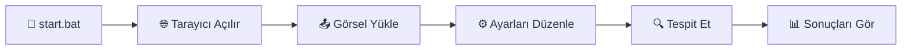

<div align="center">

# 🚦 Trafik İşareti Tanıma Sistemi

### YOLOv8 ile Güçlendirilmiş Akıllı Tespit Sistemi

[](https://www.python.org/)
[](https://github.com/ultralytics/ultralytics)
[](https://gradio.app/)
[](https://pytorch.org/)
[](LICENSE)

<p align="center">
  
  
  
  
</p>

---

### 📸 Ekran Görüntüleri


</div>

## ✨ Özellikler

<table>
<tr>
<td width="50%">

### 🎯 Model Özellikleri
- ⚡ **YOLOv8 Nano Model** - Hızlı ve verimli
- 🧠 **264 Sınıf Desteği** - Geniş kapsama
- 📊 **Gerçek Zamanlı Tespit** - Anlık sonuçlar
- 🎓 **Transfer Learning** - Önceden eğitilmiş

</td>
<td width="50%">

### 💻 Uygulama Özellikleri
- 🖼️ **Gradio Arayüzü** - Web tabanlı
- ⚙️ **Ayarlanabilir Parametreler** - Threshold kontrolü
- 🚀 **Tek Tıkla Kurulum** - Kolay başlangıç
- 📱 **Responsive Tasarım** - Her cihazda çalışır

</td>
</tr>
</table>

## 📋 Gereksinimler

<div align="center">

| Gereksinim | Minimum | Önerilen |
|:----------:|:-------:|:--------:|
| 🐍 **Python** | 3.10+ | 3.11+ |
---

## 🚀 Hızlı Başlangıç

<details open>
<summary><b>📥 Adım 1: Depoyu İndirin</b></summary>
<br>
| 🖥️ **GPU** | Opsiyonel | CUDA destekli |

</details>

<details open>
<summary><b>📦 Adım 2: Model Dosyasını Ekleyin</b></summary>
<br>

## 🚀 Kurulum

### 1. Depoyu İndirin veya Klonlayın

```bash
> ⚠️ **Önemli**: Model dosyası olmadan uygulama çalışmayacaktır!

</details>

<details open>
<summary><b>▶️ Adım 3: Uygulamayı Başlatın</b></summary>
<br>om/kullaniciadi/trafik-isareti-tanima.git
cd trafik-isareti-tanima
```

### 2. Model Dosyasını Yerleştirin

`best.pt` model dosyasını proje ana dizinine kopyalayın. Model dosyası eğitim sonucunda oluşturulmuş ağırlık dosyasıdır.

### 3. Uygulamayı Başlatın


> 💡 **İpucu**: İlk çalıştırmada bağımlılıklar otomatik yüklenecektir.

</details>

--- Rehberi

<div align="center">



</div>

### 📝 Adım Adım

<div align="center">

### 🎯 Temel Metrikler

| Metrik | Değer | Durum |
|:------:|:-----:|:-----:|
| 🏷️ **Model** | YOLOv8n (Nano) | ✅ |
| 📦 **Sınıf Sayısı** | 264 | ✅ |
| 🎯 **mAP50** | 32.5% | ⚠️ |
| 🎪 **Precision** | 63.7% | ✅ |
| 🔍 **Recall** | 27.9% | ⚠️ |
| 🔄 **Epoch** | 50 | ✅ |

### 📈 Performans Grafiği

```
Precision ████████████████████████████████████████████████████████████░░ 63.7%
Recall    ████████████████████████████░░░░░░░░░░░░░░░░░░░░░░░░░░░░░░░░ 27.9%
mAP50     ████████████████████████████████░░░░░░░░░░░░░░░░░░░░░░░░░░░░ 32.5%
```

</div>

> ⚠️ **Not**: Recall ve mAP değerleri düşük olduğu için bazı trafik işaretleri kaçırılabilir.  
> 💡 **Geliştirme**: Daha fazla veri ve epoch ile model performansı artırıla

<table>
<tr>
<td width="50%">

**🎯 Confidence Threshold**
```
Değer: 0.01 - 1.00
Varsayılan: 0.25
```
- ⬆️ Yüksek değer = Az ama güvenilir tespit
- ⬇️ Düşük değer = Çok ama belirsiz tespit

</td>
<td width="50%">

**🔗 IoU Threshold**
```
Değer: 0.01 - 1.00
Varsayılan: 0.45
```
- ⬆️ Yüksek değer = Daha az çakışma toleransı
- ⬇️ Düşük değer = Daha fazla çakışma toleransı

</td>
</tr>
</table>
python -m venv .venv
.venv\Scripts\activate
pip install -r requirements.txt
python app.py
```

---

## 🔧 Sorun Giderme

**Çözümler:**
- ✅ Python'un PATH'e eklendiğinden emin olun
- ✅ `best.pt` dosyasının proje dizininde olduğunu kontrol edin
- ✅ `.venv` klasörünü silin ve tekrar deneyin
- ✅ `run_log.txt` dosyasını kontrol edin

</details>

<details>
<summary><b>🔌 Port 7860 Kullanımda Hatası</b></summary>
<br>elden trafik işareti içeren bir görsel seçin
4. **Parametreleri Ayarlayın** (isteğe bağlı):
**Çözüm:**
```python
# app.py dosyasında server_port değerini değiştirin
demo.launch(server_port=7861)  # veya 7862, 7863...
```

</details>
**Çözümler:**
- ✅ `best.pt` dosyasının bozuk olmadığını kontrol edin
- ✅ Yeterli disk alanı (min 2GB) olduğundan emin olun
- ✅ Antivirüs yazılımının engelleme yapmadığını kontrol edin
- ✅ Dosya izinlerini kontrol edin

</details>

<details>
<summary><b>📉 Düşük Tespit Performansı</b></summary>
<br>
| Metrik | Değer |
|--------|-------|
| **Model** | YOLOv8n (Nano) |
| **Sınıf Sayısı** | 264 |
| **mAP50** | 32.5% |
| **Precision** | 63.7% |
| **Recall** | 27.9% |
| **Eğitim Epoch** | 50 |

> **Not**: Düşük performans nedeniyle bazı trafik işaretleri tespit edilemeyebilir. Model daha fazla veri ve eğitim ile geliştirilebilir.

## � Veri Seti

Bu projede kullanılan trafik işareti tanıma veri seti Kaggle'dan edinilebilir:

🔗 **Dataset Linki**: [Traffic Sign Recognition YOLOv8 Dataset](https://www.kaggle.com/datasets/lara311/traffic-sign-recognition-yolov8?resource=download)

> **Not**: Dataset bu repository'de bulunmamaktadır. Yukarıdaki linkten indirip `dataset/` klasörüne yerleştirmeniz gerekmektedir.

## �📁 Proje Yapısı

```
modelegtm/
├── app.py                      # Ana Gradio uygulaması
├── start.bat                   # Hızlı başlatma scripti
├── run.bat                     # Detaylı kontrol scripti
├── best.pt                     # Eğitilmiş YOLOv8 modeli
├── yolov8n.pt                  # Temel YOLOv8 modeli
├── requirements.txt            # Python bağımlılıkları
├── README.md                   # Proje dokümantasyonu
├── dataset/                    # Eğitim veri seti
│   ├── train/                  # Eğitim görselleri ve etiketleri
│   ├── valid/                  # Doğrulama görselleri
│   ├── test/                   # Test görselleri
│   └── data.yaml               # Dataset konfigürasyonu
├── dataset_cleaned/            # Temizlenmiş veri seti
├── runs/                       # Eğitim ve tahmin sonuçları
└── .venv/                      # Python sanal ortamı
```

## 🛠️ Teknolojiler

- **[Ultralytics YOLOv8](https://github.com/ultralytics/ultralytics)**: Nesne tespiti için
- **[Gradio](https://gradio.app/)**: Web arayüzü için
- **[PyTorch](https://pytorch.org/)**: Derin öğrenme framework'ü
- **[OpenCV](https://opencv.org/)**: Görüntü işleme
- **[Pillow](https://python-pillow.org/)**: Görsel manipülasyonu
**Çözümler:**
- 📉 Confidence threshold'u düşürün (örn: 0.15 - 0.20)
- 📸 Daha net ve yüksek çözünürlüklü görseller kullanın
- 🎯 Görselde trafik işaretinin belirgin olduğundan emin olun
- 🌞 İyi aydınlatmalı görseller tercih edin
- 📏 Trafik işaretinin görsel içinde yeterince büyük olması

</details>

---
```txt
ultralytics>=8.0.0
gradio>=3.50.0
pillow>=9.0.0
opencv-python>=4.5.0
numpy>=1.21.0
torch>=2.0.0
torchvision>=0.15.0
```

## 🔧 Sorun Giderme
<div align="center">

### 📊 Veri Seti İstatistikleri

| Kategori | Görsel Sayısı | Yüzde |
|:--------:|:-------------:|:-----:|
| 🎯 **Eğitim** | ~800 | 84% |
| ✅ **Doğrulama** | ~100 | 11% |
| 🧪 **Test** | ~50 | 5% |
| **📦 Toplam** | **~950** | **100%** |

### ⚙️ Eğitim Parametreleri

```yaml
Model: YOLOv8n
Epochs: 50
Batch Size: 16
Image Size: 640x640
<div align="center">

### 🤝 Katkılarınız Değerli!

Projeye katkıda bulunmak için:

</div>

```bash
# 1️⃣ Projeyi fork edin
# 2️⃣ Feature branch oluşturun
git checkout -b feature/AmazingFeature

# 3️⃣ Değişikliklerinizi commit edin
---

## 📞 İletişim & Destek

<div align="center">

### 💬 Bize Ulaşın

<table>
<tr>
<td align="center" width="33%">

### 📧 Email
[email@example.com](mailto:email@example.com)

</td>
<td align="center" width="33%">

### 🐛 Issues
[GitHub Issues](https://github.com/kullaniciadi/trafik-isareti-tanima/issues)

</td>
<td align="center" width="33%">

### 💬 Discussions
[GitHub Discussions](https://github.com/kullaniciadi/trafik-isareti-tanima/discussions)

</td>
</tr>
</table>

</div>

---

## 🙏 Teşekkürler

<div align="center">

Bu proje aşağıdaki harika açık kaynak projeler sayesinde mümkün oldu:

<table>
<tr>
<td align="center" width="25%">
<br>
<b>Ultralytics</b>
<br>
<sub>YOLOv8 Framework</sub>
<br><br>
⭐️
</td>
<td align="center" width="25%">
<br>
<b>Gradio</b>
<br>
<sub>Web Arayüzü</sub>
<br><br>
⭐️
</td>
<td align="center" width="25%">
<br>
<b>Roboflow</b>
<br>
<sub>Veri Seti</sub>
<br><br>
⭐️
</td>
<td align="center" width="25%">
<br>
<b>PyTorch</b>
<br>
<sub>Deep Learning</sub>
<br><br>
⭐️
</td>
</tr>
</table>

---

### 🌟 Projeyi Destekleyin

<p align="center">
  <a href="https://github.com/kullaniciadi/trafik-isareti-tanima">
    
  </a>
  <a href="https://github.com/kullaniciadi/trafik-isareti-tanima">
    
  </a>
</p>

<p align="center">
  <strong>⭐ Projeyi beğendiyseniz yıldız vermeyi unutmayın!</strong>
  <br>
  <sub>Her yıldız bizi motive ediyor! 💪</sub>
</p>

---

<p align="center">
  Made with ❤️ by <a href="https://github.com/kullaniciadi">@kullaniciadi</a>
  <br>
  <sub>© 2026 Trafik İşareti Tanıma Sistemi</sub>
</p>

</div>

> 🌟 **Veri Kaynağı**: [Roboflow Traffic Sign Dataset](https://roboflow.com/
### Port 7860 Kullanımda Hatası

```bash
# Çalışan uygulamayı durdurun veya app.py'de portu değiştirin
demo.launch(server_port=7861)  # Farklı bir port kullanın
```

### Model Yüklenmiyor

- ✅ `best.pt` dosyasının bozuk olmadığını kontrol edin
- ✅ Yeterli disk alanı olduğundan emin olun
- ✅ Antivirüs yazılımının engelleme yapmadığını kontrol edin

### Düşük Tespit Performansı

- 📉 Confidence threshold'u düşürün (örn: 0.15)
- 📸 Daha net ve yüksek çözünürlüklü görseller kullanın
- 🎯 Görselde trafik işaretinin belirgin olduğundan emin olun

## 🎓 Eğitim Detayları

Model, Roboflow'dan alınan trafik işareti veri seti ile eğitilmiştir:

- **Eğitim Görselleri**: ~800 görsel
- **Doğrulama Görselleri**: ~100 görsel  
- **Test Görselleri**: ~50 görsel
- **Augmentation**: Otomatik veri artırma uygulandı
- **Eğitim Süresi**: ~2-3 saat (GPU ile)

## 📝 Lisans

Bu proje MIT lisansı altında lisanslanmıştır.

## 👥 Katkıda Bulunma

Katkılarınızı bekliyoruz! Lütfen şu adımları izleyin:

1. Projeyi fork edin
2. Feature branch oluşturun (`git checkout -b feature/AmazingFeature`)
3. Değişikliklerinizi commit edin (`git commit -m 'Add some AmazingFeature'`)
4. Branch'inizi push edin (`git push origin feature/AmazingFeature`)
5. Pull Request oluşturun

## 📞 İletişim

Sorularınız veya önerileriniz için:

- 📧 Email: [email@example.com](mailto:email@example.com)
- 🐛 Issues: [GitHub Issues](https://github.com/kullaniciadi/trafik-isareti-tanima/issues)

## 🙏 Teşekkürler

- [Ultralytics](https://github.com/ultralytics/ultralytics) - YOLOv8 modeli için
- [Roboflow](https://roboflow.com/) - Veri seti için
- [Gradio](https://gradio.app/) - Harika arayüz kütüphanesi için

---

<div align="center">
  <strong>⭐ Projeyi beğendiyseniz yıldız vermeyi unutmayın!</strong>
</div>
